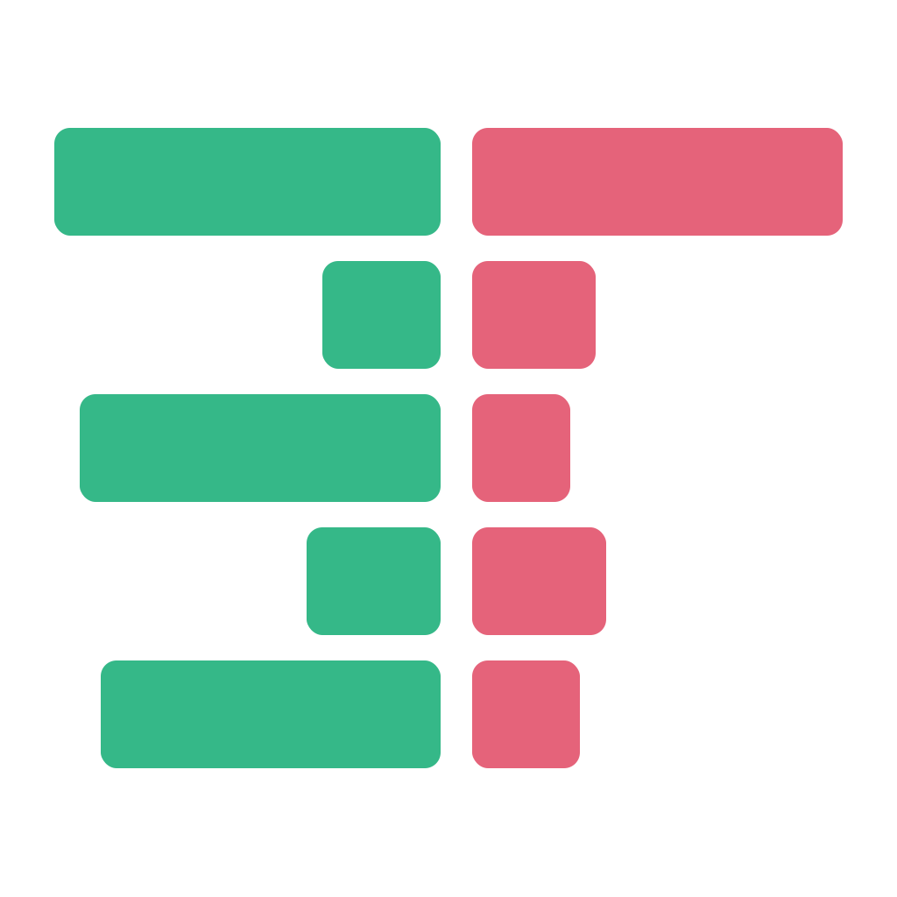

<div align="center">



# eTape

**A free, open-source day-trading platform — read the tape, work the ladder, fire orders from hotkeys.**

Real-time charts · Level 2 DOM ladder · Time & Sales · Pre-market scanner · Multi-broker execution


[](LICENSE)
[](https://github.com/earlisreal/eTape/releases/latest)

<!-- SCREENSHOT: drag your screenshot into the GitHub README editor (or any issue
     comment) to upload it, then replace the URL below with the generated
     https://github.com/user-attachments/assets/... link. -->


</div>

---

eTape is a trading platform built the way scalpers and momentum day traders actually work:
one screen with fast charts, a live order book, the tape, and one-keystroke order entry —
running **entirely on your own machine**. No subscription, no cloud middleman, no
per-month platform fee. Bring a [moomoo](https://www.moomoo.com/) account for market data
and the broker of your choice for execution, and everything else is free and open source.

## Why eTape?

- **Speed as a design rule.** The engine is pure Go; the chart, ladder, and tape are
  canvas surfaces painted imperatively and coalesced to one repaint per frame.
  High-frequency market data never touches React state.
- **10-second candles, built live from raw ticks.** Sub-minute momentum most retail
  platforms simply can't show — bucketed by exchange timestamp with live buy/sell
  direction, straight off the tick feed.
- **A real Level 2 DOM ladder.** Full-depth order book rendered on canvas, fed by
  moomoo's tick-and-depth feed — not a 1-level quote widget.
- **Broker-agnostic execution.** The same order ticket, hotkeys, and risk gates drive
  TradeZero, Alpaca, or the built-in simulator. Fills come back as generic events and
  land on your chart as markers in real time, whatever the venue.
- **Safety-gated by default.** Zero venues are configured out of the box. Every order
  must pass a two-layer risk gate (global caps + per-venue caps: max day loss, order
  value, position size, open orders), and each venue has an explicit arm/disarm switch.
- **Every session recorded.** An always-on SQLite journal captures the full feed —
  quotes, ticks, books, bars — so any day can be replayed through the same engine
  (this is also how demo mode and the E2E suite work).
- **Local-first and private.** Config, credentials, and the journal live in `~/.eTape/`
  on your disk. The UI is served from `127.0.0.1`. Your API keys talk to your broker
  and no one else.

## Features

**Charting**
- TradingView [Lightweight Charts](https://github.com/tradingview/lightweight-charts)
  candlesticks, from 10-second bars up to daily/weekly/monthly
- Indicators: VWAP, EMA, SMA, MACD, Volume
- Drawing tools — horizontal line, trend line, extended line, rectangle — with
  per-tool color/width/style memory
- Live fill markers (buy/sell diamonds) and fill sounds
- Extended-hours (pre-market / after-hours) data support

**Order flow**
- Level 2 DOM ladder with full order-book depth
- Time & Sales tape with buy/sell coloring, virtualized over a ring buffer

**Scanning & context**
- Pre-market gap scanner with float, volume, and %-change filters
- Session-aware top movers (pre-market / regular hours / after-hours)
- Stock Info panel: fundamentals grid plus a live news feed with publish times and
  type badges

**Execution**
- Order ticket with market / limit / stop / stop-limit
- Hotkey deck: configurable one-keystroke order templates with price offsets and
  position sizing by buying-power % or position %
- Account, positions, open orders, and trade-history panels
- Built-in **paper simulator with realistic fills**: orders walk the live book,
  partial fills, resting limit orders, configurable slippage and fill latency

**Workspace**
- Dockable, drag-and-drop panel layout ([dockview](https://dockview.dev/)) — arrange
  chart/ladder/tape/scanner however you trade, with linked symbol groups
- Type a ticker anywhere to load a symbol — the engine subscribes on demand
- In-app settings for venues, credentials, hotkeys, and appearance

## How it works

```
                     ┌─────────────────────────────────────────────┐
 moomoo OpenD ─────▶ │             eTape engine (Go)               │
 (market data,       │ order books · 10s/1m bar building · tape    │
  localhost TCP)     │ scanner · news · indicators · risk gate     │
                     │ SQLite journal · broker adapters            │
                     └───────────────────┬─────────────────────────┘
                                         │ WebSocket + JSON (127.0.0.1:8686)
                     ┌───────────────────▼─────────────────────────┐
                     │           eTape UI (React + TS)             │
                     │ canvas chart · DOM ladder · tape · panels   │
                     └─────────────────────────────────────────────┘

 Execution venues: built-in simulator · Alpaca (paper/live) · TradeZero · moomoo (paper/live)
```

The engine speaks OpenD's wire protocol natively in Go (no Python SDK required),
builds books/bars/indicators, journals everything to SQLite, and serves the UI over a
localhost WebSocket. TypeScript types for the wire contract are generated from the Go
structs, so the two sides can't silently drift.

## Download

**[⬇ Download the latest release](https://github.com/earlisreal/eTape/releases/latest)** —
a prebuilt, self-contained binary with the UI embedded. Single file, no installer,
no Go or Node toolchain required.

| Platform | Artifact | Run it |
|---|---|---|
| Windows (x64) | `eTape-<version>-windows-amd64.zip` | Unzip, then double-click `etape-demo.cmd` to try the demo — or run `etape.exe` for live mode. `README-FIRST.txt` inside covers the details. |
| macOS (Apple Silicon) | `eTape-<version>-macos-arm64.tar.gz` | `tar xzf` it, then `./etape-darwin-arm64 -demo` — or run it without the flag for live mode. |

The binaries aren't code-signed (personal-use release, no certificate), so expect a
one-time warning on first launch: Windows SmartScreen says "unrecognized app" —
click **More info → Run anyway**; macOS Gatekeeper blocks it — right-click →
**Open** (or `xattr -d com.apple.quarantine etape-darwin-arm64`).

Prefer building from source? The quick start below has you covered.

## Quick start from source

Demo mode, no accounts needed. Prerequisites: [Go](https://go.dev/dl/) ≥ 1.26 and
[Node.js](https://nodejs.org/) 22 LTS on your `PATH`.

```bash
git clone https://github.com/earlisreal/eTape.git
cd eTape
./run.sh demo          # Windows: run.cmd demo
```

This builds the UI, generates a synthetic trading day, and opens the full app at
`http://127.0.0.1:8686` with a funded paper simulator — charts ticking, ladder moving,
and hotkeys live, with **no OpenD, no broker, and no config**. Place trades immediately.

```bash
./run.sh demo 2026-01-02 0    # replay the synthetic day as fast as possible
```

## Live market data: moomoo OpenD

eTape's market data comes from **moomoo OpenD**, the local gateway that ships with
moomoo's [OpenAPI](https://openapi.moomoo.com/) program. One-time setup:

1. **Create a moomoo account** at [moomoo.com](https://www.moomoo.com/) and enable
   OpenAPI access.
2. **Download and install OpenD** for your OS from the
   [OpenAPI portal](https://openapi.moomoo.com/).
3. **Launch OpenD and log in** with your moomoo credentials. By default it listens on
   `127.0.0.1:11111`, which is where eTape expects it.
4. Run eTape in live mode:

   ```bash
   ./run.sh live          # Windows: run.cmd live
   ```

Then just type a ticker in any panel — the engine subscribes on demand, and the
scanner keeps the day's top movers warm automatically.

**Quote entitlements** (check what your moomoo account includes for US stocks):

| Your entitlement | What works |
|---|---|
| Level 1 quotes | Charts, time & sales, scanner, movers, news — everything except book depth |
| Level 2+ depth | All of the above **plus** the full DOM ladder |

Notes:
- eTape only ever *reads* market data from OpenD. It never sends trade commands to it
  and never touches your moomoo trade password.
- US stocks only for now — one market keeps sessions, timezones, and entitlements simple.

## Connecting brokers

| Venue | Environments | Status |
|---|---|---|
| **Built-in simulator** (`sim`) | paper | ✅ Realistic fills: book-walk pricing, partials, slippage & latency models |
| **Alpaca** | paper + live | ✅ Fully supported (REST + streaming) |
| **TradeZero** | live | ✅ Fully supported (REST + WebSocket) |
| **moomoo** | paper + live | ✅ Fully supported (native OpenD trade connection) |

Execution is **off by default** — with no venues configured, every order is blocked.
The easiest way to add one is in-app: **Settings → Venues** lets you add a venue,
enter API credentials, and test the connection; it writes the config for you (with an
automatic backup of your previous `config.toml`).

Credentials are stored locally in `~/.eTape/credentials.json` and are only ever sent
to the broker they belong to. moomoo is the exception — it has no API key/secret at
all; it authenticates over the same local OpenD connection as market data, keyed by
account ID, and trade unlock happens once per OpenD restart in the OpenD GUI itself
(never inside eTape).

Before any order reaches a broker it must pass the **two-layer risk gate** — global
caps (max day loss, per-symbol position value/shares) and per-venue caps (max order
value, position size, open orders) — and the venue must be explicitly **armed** in
the UI. Live venues trade real money; configure them deliberately.

## Configuration

Everything lives in `~/.eTape/` (`%USERPROFILE%\.eTape\` on Windows):

| File | Purpose |
|---|---|
| `config.toml` | Engine config — optional; a missing file means built-in defaults |
| `credentials.json` | Broker API keys (managed by Settings → Venues) |
| `etape.db` | SQLite feed journal + bar archives (created automatically) |

A minimal hand-written config with a paper simulator and tight risk caps:

```toml
# ~/.eTape/config.toml — every omitted field falls back to a sane default

[[venue]]
id = "sim-paper"
broker = "sim"            # sim | alpaca | tradezero | moomoo
env = "paper"             # paper | live
starting_balance = 100000

[gate.global]
max_day_loss = 500
max_symbol_position_value = 10000
max_symbol_position_shares = 2000

[gate.venue.sim-paper]
max_order_value = 5000
max_open_orders = 10
```

The UI and WebSocket are served on `127.0.0.1:8686` by default (`[uihub]` section to
change it). OpenD is expected on `127.0.0.1:11111` (`[opend]` section).

## Windows

`run.cmd` mirrors `./run.sh` exactly — same modes, same arguments — and needs nothing
beyond Go, Node.js, and (for live mode) OpenD for Windows. For a self-contained
distributable there's also:

```bash
cd engine && make release-windows
```

which produces `dist/etape-windows-amd64.exe` — a single binary with the UI embedded
and a system-tray icon, no console window, no installer. `make release-macos` does the
same for macOS (arm64). The engine is pure Go (no cgo), so cross-compiling from any OS
just works. Prebuilt binaries for both platforms are attached to the
[latest release](https://github.com/earlisreal/eTape/releases/latest).

## Development

```
engine/     Go engine — feed, books, bars, scanner, brokers, risk gate, WS hub
ui/         React + TypeScript + Vite UI — panels, canvas renderers, settings
docs/       Design docs, decision records, and approved specs
prototypes/ Python research scripts (latency benchmarks, tick aggregation, …)
```

| Task | Command |
|---|---|
| UI iteration w/ hot reload | `./run.sh dev [fixture]` (mock engine + Vite on `:5173`) |
| Engine tests | `cd engine && make test` (`go test -race ./...`) |
| Engine lint / vet | `cd engine && make lint` / `make vet` |
| UI unit tests | `cd ui && npm test` |
| UI typecheck / lint | `cd ui && npm run typecheck` / `npm run lint` |
| E2E (Playwright, real engine in replay mode) | `cd ui && npm run e2e` |
| Regenerate TS wire types from Go | `cd engine && make gen-ts` (`gen-ts-check` to verify drift) |

The Go structs are the single source of truth for the engine↔UI protocol —
`ui/src/gen/wsmsg.ts` is generated, never hand-edited.

## Roadmap

- Interactive practice mode: trade any recorded day against the simulator on replay
- Desktop packaging (Wails)
- Smarter extended-hours order handling

## Disclaimer

eTape is a tool, not advice. Day trading involves substantial risk of loss. This
software is provided **as-is, without warranty of any kind**; you are solely
responsible for any orders placed through it and for complying with your brokers'
terms. Test against the simulator or a paper account before arming a live venue.

## Contributing

Issues, bug reports, and pull requests are welcome. If you're adding a broker
adapter or a panel, open an issue first — the approved design specs in
`docs/superpowers/specs/` explain the architecture decisions you'll want to fit into.

## License

[MIT](LICENSE) — free to use, modify, and distribute.
