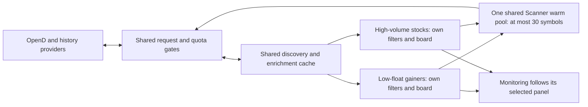

# Independent Scanner Panels

Status: Implemented; local validation completed on 2026-10-03.

## Goal

Run independent Scanner Panels on one shared market-data service, normally two:
low-float gainers and high-volume stocks. Each panel owns its filters, sticky
Scanner Board, ranking, seen/unseen state and new-hit eligibility. High-volume
discovery must include stocks absent from the top gainers/losers and rank by
the active Session Volume.

Adding panels must not multiply provider budgets or the Scanner subscription
pool. eTape must enforce its own request/admission limits, defer background
work under pressure and keep cached/pushed chart data available.

## Non-goals

- Separate processes, connections, accounts, services, databases or dependencies.
- New scanner strategies, threshold presets or configurable scheduling controls.
- A market-wide snapshot sweep or pagination of every change-ranked security.
- Order-entry changes or any live-order experiment.
- An absolute guarantee over requests made by other applications, remote OpenD
  clients or changes to provider limits that eTape cannot observe in advance.

## Settled decisions

1. Independent panels share one data service (Q1).
2. Normal workload is two panels: low-float gainers and high-volume stocks (Q2).
3. Each board stays sticky until its own filters change or the existing trading
   cycle resets; changing one panel does not reset another (Q3).
4. High-volume discovery includes stocks outside mover lists (Q4).
5. Refresh may slow automatically within the shared budget. Show freshness and
   give existing chart/trading data priority over background warming (Q5).
6. Ordinary scanners pause when their workspace window closes. The enabled
   Monitoring Scanner Source remains active while Monitoring consumes it (Q6).
7. High-volume ranking uses current Session Volume, separate from daily `VOL`
   and Dollar Turnover (Q7).
8. High-volume discovery shares the first 200 session-volume-ranked candidates;
   each panel applies its own filters afterward. Stocks below that cutoff are
   outside this version's discovery coverage (Q8).

## Current-code evidence

- [Engine composition](../../engine/cmd/etape/main.go) creates one Scanner
  Poller in `startPollers`. [Scanner](../../engine/internal/scan/scan.go) combines
  global filters, one sticky board, discovery, caches, enrichment and warming.
  `Get/SetScannerFilters` persists one `scanner.filters.v2` record in
  [commands.go](../../engine/internal/uihub/commands.go).
- [ScannerStore](../../ui/src/data/ScannerStore.ts) is shared by all panels in a
  window. Rank, baseline, seen/unseen and sound events are session-scoped.
  [ScannerPanel](../../ui/src/chrome/panels/ScannerPanel.tsx) already persists
  sort, columns and mute separately; filters are still global.
- Current gainers/losers discovery requests the first 100 native session-ranked
  stocks. Thresholds apply afterward. RTH Most active requests the first 200
  daily-volume-ranked StockFilter results. Extended Most active merges the first
  100 gainers and 100 losers, so it misses high-volume non-movers.
- A `poke` performs a full acquisition poll outside the normal cadence.
  Enrichment completions and filter edits can therefore cause extra provider
  requests. Per-poll static/snapshot limits of eight are not rolling rate limits.
  The sticky board itself is uncapped.
- [OpenD Client.Request](../../engine/internal/feed/opend/client.go) has no
  central request limiter. Snapshot requests also come from stock information,
  Watchlist and symbol validation. Several batch callers split every provider
  error, which can amplify throttling failures.
- [Quota monitoring](../../engine/internal/quota/poller.go) reads counters every
  60 seconds and only warns. [Subscription admission](../../engine/internal/feed/opend/subman.go)
  uses a local slot cap, adds before removing and does not govern admission from
  the latest account-wide remaining quota.
- [Scanner Pool](../../engine/internal/scan/pool.go) tracks the top ten and keeps
  at most 30 sticky warm symbols. It drives TICKER demand plus archive/REL VOL
  warming and news/stock information. It is distinct from Scanner Board rows.
- [WorkspaceStore](../../ui/src/chrome/workspace.ts) already saves per-panel
  settings in `workspace.<name>`. [Store.ListConfig](../../engine/internal/store/config.go)
  can restore definitions. The existing `OnConfigSet` hook runs after writing
  and cannot reject bad filters; workspace deletion also needs reconciliation.
- Monitoring already identifies its source by workspace and panel IDs and
  keeps following it after its host window closes. Preserve those semantics.
- [Alpaca history](../../engine/internal/hist/alpaca/alpaca.go) shares one client
  between charts and Scanner REL VOL, currently with a 200/minute, burst-five
  bucket. Runtime archive warming uses Alpaca/Yahoo and OpenD local cached bars,
  rather than new OpenD historical requests.

## Live facts collected on 2026-10-03, Manila time

Evidence lives in [.scratch/independent-scanners](../../.scratch/independent-scanners/).
All probes were read-only and created zero subscriptions. No settings or orders
were changed. Account-wide usage moved while the user continued using eTape;
the before/after readings within each completed API probe were unchanged.

- Passive engine observation for 40 seconds: 11 after-hours rows, 20 deltas at
  two-second intervals, subscriptions 31 used / 269 free, history 0 / 300, no
  foreign subscription usage reported. Reading UI topics added no OpenD calls.
- Three sparse native after-hours rank pages: 200 rows each, total 18,178,
  roughly 0.09 seconds per call. Page offset 200 included GME with about four
  million after-hours shares and +1.943%, beyond the first 100 gainers. Deep
  pagination returned zero-change stocks with positive session volume.
  This proves reach beyond the current cutoff, not stable exhaustive pagination.
- One native Go V2 request (`3252`) sorted the US screener universe by
  `AFTER_VOLUME=2409`: 200 rows, total 12,143, descending volume, 0.161 seconds.
  The probe owned zero subscriptions; account usage was 27 / 273 before and after.
- One five-symbol snapshot confirmed the top V2 volumes belong to after-hours,
  rather than base daily volume. WBD, NOK and T had zero change and millions of
  after-hours shares. Minor volume differences reflected later updates.
- V2 change values in this response are fractional values; snapshot change is
  in percentage points. Keep V2 discovery limited to code and volume and retain
  the established snapshot normalization for published price/change fields.
- The Python V2 attempt failed during request packing because its installed
  protobuf descriptor API lacked `label`; no V2 request was sent by that attempt.
  The existing Go protobuf path worked without upgrading anything.

Premarket and overnight V2 factors are present in the installed official SDK,
but were not live-tested during their matching sessions. The live engine's
configuration is two-second extended polling and three-second RTH polling;
repository defaults are one second. Live observations do not validate those
faster defaults or identify the running executable's exact source revision.

Planning discovery checks: 17 local links resolved and all five read-only evidence
captures parsed as JSON. The captures contain no credentials, account identifiers,
balances, live keys, or capture secrets. Runtime validation remains offline; no
OpenD requests were made while implementing this plan.

## Shared discovery and independent evaluation

Keep one acquisition owner in `scan`. Separate its shared caches/workers from
small per-panel state records; do not construct a Poller per panel.

- Reuse native session ranks for gainers/losers. Share requests by session,
  ranking direction and page; changing local thresholds does not create a new
  provider query.
- For RTH high-volume discovery, reuse the existing `3215` volume-sorted request.
- For extended high-volume discovery, use existing generated
  [Qot_StockScreen](../../engine/internal/feed/opend/pb/proto/Qot_StockScreen.proto)
  / [Go types](../../engine/internal/feed/opend/pb/qotstockscreen/Qot_StockScreen.pb.go).
  Select US (`ScrMarket=2`), descending order (`direction=2`) and the matching
  volume factor: premarket `2404`, after-hours `2409`, overnight `2418`. Retrieve
  code and volume only. Add the protocol constant `3252` to `protoid.go`.
- One shared first page of 200 volume candidates per session.
  This is a volume-ranked provider universe, independent of price movers.
  Local filters still apply after that cutoff; it is not every matching US stock.
- Each panel applies its own filters and sticky admissions to its discovery
  candidates. Panels can admit the same stock independently. Existing null,
  session/date, Rule 201 and raw threshold semantics remain authoritative.
- Deduplicate the union of fresh candidates needing enrichment and all active
  boards, then snapshot in batches of at most 400. Resolve static information
  once per symbol with the existing caches. Budget-deferred symbols stay pending;
  they are not classified as missing or invalid merely because no call was made.
- Use deterministic rotation for deferred snapshot work; a growing board must
  reduce freshness without starving the same symbols or creating an unbounded
  queue of obsolete refresh jobs. Keep at most one pending refresh per data key.
- Enrichment completion and filter edits evaluate/publish cached data. They
  cannot bypass discovery or snapshot pacing. Preserve actual provider freshness
  timestamps when republishing; a new publication alone is not a new data refresh.
- Unknown V2 values remain absent, never zero. Unsupported current-session
  discovery is shown as unavailable/delayed, with cached results labelled by
  freshness; never silently fall back to mover-only high-volume coverage.

## Request budgets and quota admission

Use cancellable, evenly spaced per-endpoint gates at the shared OpenD request
seam, with conservative margins. All eTape callers, failed sends, batch splits,
retries, bootstrap and reconnect work use the same gates. The shared Alpaca
history token bucket has a burst of two so Scanner history can reserve one token
for foreground chart history; its steady rate remains 150/minute and provider
headers or 429 responses can lower it. Reuse the existing clock/rate dependency;
no scheduler framework is needed.

| Request family | Verified published maximum | Proposed minimum send spacing |
| --- | --- | --- |
| Snapshot `3203` | [60/30 seconds, 400 codes](https://openapi.moomoo.com/moomoo-api-doc/en/quote/get-market-snapshot.html) | 750 ms; at most 41 attempts in a 30-second interval |
| OpenD historical K-lines `3103` | [60/30 seconds; continuation pages exempt](https://openapi.moomoo.com/moomoo-api-doc/en/quote/request-history-kline.html) | 750 ms; charge every page conservatively on existing callable paths |
| Native rank `3410`–`3413` | [60/30 seconds; first page counted](https://openapi.moomoo.com/moomoo-api-doc/en/quote/get-us-pre-market-rank.html) | 1 second per endpoint; charge all pages conservatively |
| StockFilter `3215` and V2 `3252` | [10/30 seconds each](https://openapi.moomoo.com/moomoo-api-doc/en/quote/get-stock-filter.html), [V2 limit](https://openapi.moomoo.com/moomoo-api-doc/en/quote/get-stock-screen.html) | One conservative shared gate, 5 seconds; at most 7 attempts/30 seconds |
| Subscribe/unsubscribe `3001` | No request-frequency maximum is published on the [subscription page](https://openapi.moomoo.com/moomoo-api-doc/en/quote/sub.html); slot quota and one-minute minimum unsubscribe hold apply | One second per call, including reconnect and split attempts |
| Owner Plate `3207` | [10/30 seconds, 200 codes](https://openapi.moomoo.com/moomoo-api-doc/en/quote/get-owner-plate.html) | 5 seconds across stock-information callers, including retries/splits |
| Short Interest `3249` | [30/30 seconds](https://openapi.moomoo.com/moomoo-api-doc/en/quote/get-short-interest.html) | 1.5 seconds; one shared cached worker |
| Search News `3263` | [10/30 seconds](https://openapi.moomoo.com/moomoo-api-doc/en/quote/get-search-news.html) | 5 seconds, covering every caller |
| Alpaca historical data | [Basic 200/minute; Plus 10,000](https://docs.alpaca.markets/us/v1.4.2/docs/about-market-data-api) | Keep conservative 150/minute with burst two and one token reserved for foreground chart history; honor lower response-header budgets |

Normal target: rank/snapshot refresh every two seconds when work and budget
permit; high-volume discovery every five seconds. These are different clocks.
Additional panels share requests and can cause longer snapshot refresh cycles,
never a higher request budget. Scanner calls are marked background and queued
behind foreground calls sharing a family. Do not raise budgets based on an
assumed premium entitlement. Static-info/counter interfaces have no numeric
frequency published in the inspected docs; use cached, bounded reads, not an
unlimited exemption.

Keep gates across reconnects. At process restart, use a conservative initial
quiet period for rate-limited requests (30 seconds plus margin for OpenD,
60 seconds plus margin for Alpaca) unless authoritative reset information safely
permits earlier work. Cached UI and existing push/cache paths can proceed.
This avoids forgetting the previous process's active request window.

The [provider's frequency rule](https://openapi.moomoo.com/moomoo-api-doc/en/qa/quote.html)
uses a rolling window, including a strict boundary. Verify maximum counts under
concurrency with the fake clock; neither a per-poll cap nor an average-rate bucket
at the provider's exact maximum is enough.

For subscription/history quotas:

- Keep one global Scanner warm pool, cap 30 total across panels, with fair
  selection and symbol deduplication. Preserve existing demand priority so
  focused charts and execution-related demand outrank Scanner warming.
- Require an authoritative quota reading before new background admissions;
  refresh before admitting a batch when the reading cannot safely cover it.
  Respect `feed.quota_slots` and leave the existing configured subscription
  headroom (`quota_warn_headroom`, default 12) for foreground demand.
- Reserve required symbol/subtype slots atomically within eTape before sending.
  Account for pending admissions and retained/retiring slots. Release requests
  do not immediately create reusable quota: subscriptions have a one-minute hold
  and other connections may still own the same symbol/subtype.
- At unknown/exhausted quota, defer new demand. Existing pushes and cached data
  continue; user-facing demand gets a clear waiting state rather than an
  optimistic request that exceeds the known remaining allowance.
- Keep Scanner archive/REL VOL warming on the current history providers. Do not
  activate the unused OpenD history fallback. Correct stale thirty-day wording
  and its latent exemption to the authoritative [seven-day history window](https://openapi.moomoo.com/moomoo-api-doc/en/intro/authority.html).
  Any existing callable OpenD history path must reserve unique-symbol quota and
  respect history headroom and the separate request-frequency gate. Repeated
  requests for a quota-exempt symbol still consume request frequency; unused
  production paths need not gain new features.
- Classify account-wide quota, rate, permission and transport failures before
  splitting batches. Split only a known symbol-specific failure; other failures
  back off/defer once and do not quarantine valid symbols. Every retry is paced.
- Honor Alpaca remaining/reset headers and 429 responses across the shared
  history client. Scanner enrichment remains lower priority, sequential, cached
  and deduplicated by symbol/represented day.

eTape can enforce its own configured budgets. External-client rate usage is not
fully exposed, and quota counters can race another client. Keep margins, use
authoritative counters and pause affected work on contention; do not claim that
this prevents every possible provider rejection caused by external activity.

## Identity, persistence and lifecycle

Use existing `(workspaceId, panelId)` identity. Store filters in the existing
panel settings (`scannerFilters`) in `workspace.<name>`; no second persistent
scanner registry or new UUID layer.

Restore definitions from saved workspace documents at startup. Reconcile scanner
definitions and Monitoring's source when a workspace is saved/deleted. Validate
scanner identity and filters before persisting the document; the current
post-write `OnConfigSet` hook alone cannot provide that validation.

Migrate saved panels lacking filters by copying the existing validated global
filters once; all old panels initially behave as before. New panels use defaults.
Retain the legacy global record for rollback. Copy/export/import filters with
panel settings while preserving the existing non-portable Scanner Source rules.
Renaming a workspace must carry its scanner identities/boards and source reference.

Activity follows existing connection/window ownership, including hidden scanner
tabs in an open workspace and duplicate windows for the same saved panel. Closing
one duplicate window does not deactivate its peer. Disconnect releases that
connection's activity; reconnect reuses identity without duplicate acquisition.
Only the selected source needed by enabled/open Monitoring continues after its
host closes. Deletion pauses source following as today. Other closed definitions
remain saved and inactive; cycle rollover still applies when they resume.

## WebSocket and UI

Add scanner identity and session to the Go-owned rank/hit contract and commands.
Use one unambiguous identity key consistently in mirror snapshots, coalescing,
store lookup and selectors; regenerate TypeScript from Go. Publishing one board
must not replace another. Remove deleted/expired scanner mirror entries and clear
an inactive board before publishing its resumed baseline.

Store board, baseline and seen/unseen state per scanner identity and session.
Retain per-panel sort, columns, mute and Link Group behavior. High-volume defaults
to Session Volume sort and names its discovery basis clearly; daily `VOL` and
Turnover remain separate columns/filters. The exact same row's published Session
Volume drives sorting/filtering and source ordering.

Scanner Sync consumes the explicitly selected panel's board and saved sort even
when its source window is closed. Sound listeners receive only that panel's new
hits, retaining one cue per eligible window through the existing sound coalescing.
Initial/reconnect/filter-reset baselines remain silent; unseen state in one panel
does not mark another panel's rows seen.

Expose a compact freshness/waiting/paused/unavailable indication. Cached rows
remain visible during budget waits; no changing timestamp may imply a fresh
provider read. Keep high-frequency quote/chart data outside React state.

## Implementation result

The shared OpenD seam now paces request families and prioritizes foreground work;
subscription admissions reserve authoritative account-wide headroom, and history
budgets honor provider limits. Cancellation and retry classification prevent
scanner work, split batches or reconnects from amplifying a limit response.

One scanner poller shares discovery, caches, enrichment and one warm pool across
independent workspace/panel boards. Each panel keeps its filters, sticky hits,
baseline, sound eligibility and sorting. Extended high-volume discovery uses one
200-stock current-session-volume page, including flat-price stocks outside mover
lists. Workspace reconciliation keeps only Monitoring's selected source active
after its host closes. Per-row snapshot times drive honest freshness labels.

The Go-owned WebSocket contract, UI stores/controls, generated TypeScript, tests,
and root/engine/UI/API documentation were updated together. The plan and
read-only research captures remain in the versioned `.scratch/` history.

## Validation and acceptance

Use existing Go/UI suites; add focused checks for the changed behavior:

- Two panels with different modes/thresholds have independent sticky boards,
  resets and seen state. An identical data requirement creates one provider call,
  one enrichment fetch and one warm demand per symbol.
- Fake-clock concurrency proves every endpoint's rolling maximum, including
  boundary times, failures, split retries, rapid Apply, enrichments, session
  bootstrap, reconnect and repeated process starts. Cancellation does not leak
  work or reservations. Published pacing includes all sibling callers.
- Quota tests cover foreign usage, absent/stale counters, pending admissions,
  delayed releases, low/exhausted state and Scanner/foreground priority. Budget
  waits never mark a symbol bad or spend a new OpenD history slot for scanning.
- V2 decoding tests preserve missing/zero values, volume order, US/market enum
  distinctions, each session field and flat-price high-volume candidates. RTH
  stays on its verified source. No mover-only fallback masquerades as full coverage.
- Large synthetic boards and multiple panels demonstrate bounded requests,
  deduplicated 400-code chunks, deterministic deferred coverage and honest age.
- Migration/round-trip tests cover old workspaces, import/export, cloning,
  renaming, deleting, duplicate windows, reconnect and closed-source Monitoring.
- Store/UI tests cover per-panel baselines, mute/sound deduplication, sort/columns,
  delayed status, independent Apply/Reset, and Monitoring's selected board.
- Mock HTTP headers/429 prove history budget reduction/backoff and no retry storm.

Local validation results:

- Passed: `go test ./...`, `go test -race -short ./...`, `go vet ./...`, and
  `golangci-lint run` (0 issues).
- Passed: `npm test` (including golden tests), `npm run lint`, and
  `npm run build` (which includes both TypeScript typechecks).
- Passed: `go tool tygo generate`; the generated Go-owned contract is current.
  The required `mingw32-make -C engine gen-ts-check` wrapper could not start
  because Cygwin denied `NtCreateDirectoryObject` in this Windows sandbox.
- Passed: `e2e/scanner-multipanel.spec.ts` against the deterministic
  `-demo -no-open` engine on port 18686; the Playwright harness needed a stop
  after reporting the test pass, and the demo listener was confirmed closed.
- Passed: `git diff --check`.

Hosted CI must still complete after the authorized push to `main`.

No live validation was performed because the user required avoiding quota or rate
limit use. The implementation uses captured read-only facts and offline mocks;
matching-session live checks remain unverified. Do not probe limits by exhausting
quota, generate trades, or restart the user's currently running app.

## Rollout, rollback and risks

Ship the engine and UI contract together. Commit the executed plan with the
implementation, integrate/push main, and verify hosted CI under the standing
repository rules.

Rollback is a scoped revert plus the retained legacy filters. Extra panel filter
settings can be ignored by the older UI; preserve unrelated workspace fields.

Risks requiring explicit checks: V2 coverage differs from native ranks; only
after-hours has live evidence; V2 timestamps/percent units must not be mistaken
for snapshot freshness; frozen rankings at moving session boundaries; uncapped
sticky boards causing delayed refresh; workspace lifecycle races; and unknown
external-client traffic. The safeguards favor cached/paused/delayed results over
uncontrolled calls or false completeness claims.
